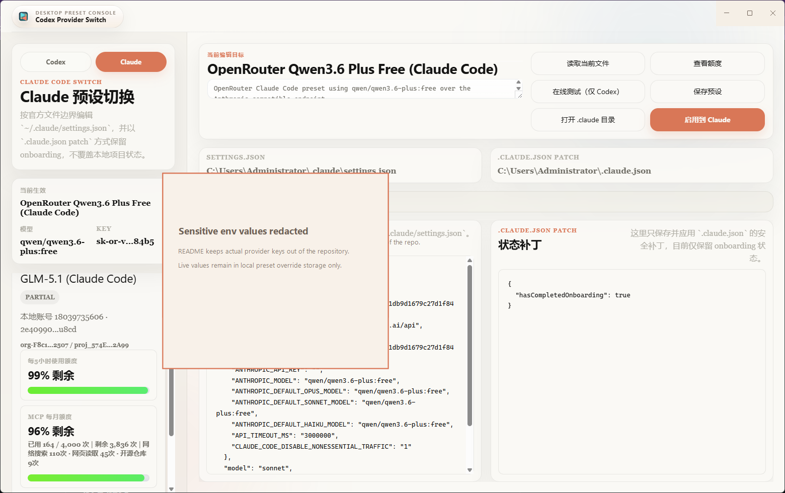
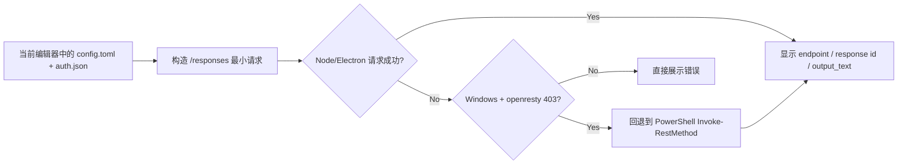

<div align="center">
  
  <h1>Codex Provider Switch</h1>
  <p><strong>一个面向 Codex 工作流的 Electron 预设切换器（Windows / macOS）</strong></p>
  <p>把 <code>config.toml</code> / <code>auth.json</code> 的切换、编辑、保存、启用和在线测试，收束到一个更友好的桌面界面里。</p>

  <p>
    
    
    
    
  </p>

  <p>
    
  </p>

  <p><sub>README 展示图已脱敏，真实 provider key 仅保存在本地预设覆盖文件中。</sub></p>
</div>

## 更新日志

最新变更记录见 [CHANGELOG.md](./CHANGELOG.md)。

## 项目定位

这个项目解决的是一个很具体、但很烦的日常问题：

- 你可能会在多个 Codex relay / provider 之间频繁切换。
- 真正生效的配置文件都在用户目录下的 `.codex` 中。
  Windows 示例：`%USERPROFILE%\.codex\config.toml`
  macOS 示例：`~/.codex/config.toml`
- 手动改文件容易漏改、改错，尤其是 `provider id`、`base_url`、`wire_api` 和密钥。
- 某些供应商“终端里能通，应用内测试却失败”，还需要单独排查网络栈差异。

`Codex Provider Switch` 的目标不是替代 Codex，而是把这层“供应商配置管理”做成一个单独、清晰、可验证的工具。

## 核心能力

| 能力 | 说明 |
| --- | --- |
| 内置默认预设 | 保留 `92scw`、`GMN`、`Gwen`、`OpenAI Official`，并新增 Claude 侧 `GLM-5.1` 预设 |
| 双文件编辑 | 同时展示并编辑 `config.toml` 和 `auth.json` |
| 保存与启用分离 | `保存预设` 只保存到应用预设库，`启用到 Codex` 才会写入用户真实生效文件 |
| 在线测试 | 直接对当前编辑中的配置发起最小 `/responses` 请求，返回状态、接口地址、响应 id 和文本 |
| 自定义预设 | 支持新增自定义预设，名称和描述都可编辑 |
| 现有预设可编辑 | 包括内置预设，也支持修改名称、描述、配置内容和密钥后再保存 |
| 目标文件可追踪 | 清楚展示当前生效文件路径，方便你确认真正写到了哪里 |
| 使用量面板 | 内置卡片可直接查看 92scw、GMN、Gwen、OpenAI，以及 Claude GLM-5.1 的当前额度信息 |
| Windows 兼容回退 | 针对部分网关拦截 Node/Electron `fetch` 的场景，在线测试可在 Windows 下自动回退到 PowerShell 请求 |

## 当前工作流

1. 在左侧选择一个内置预设，或者点击 `+ 新增预设`。
2. 在右侧直接编辑供应商名称、供应商描述、`config.toml`、`auth.json`。
3. 先点 `保存预设`，把它保存在应用自己的预设库里。
4. 需要真正切换时，再点 `启用到 Codex`，写入当前系统用户目录下的 `.codex/` 真实文件。
5. 如果想先验证联通性，直接点 `在线测试`，不需要先启用。

## 内置预设

| 预设 | `model_provider` | 接口基址 | 备注 |
| --- | --- | --- | --- |
| `92scw` | `codex` | `http://92scw.cn/v1` | 走 `responses` |
| `GMN` | `codex` | `https://gmn.chuangzuoli.com` | 走 `responses` |
| `Gwen` | `gwen` | `https://ai.love-gwen.top/openai` | 走 `responses`，Windows 在线测试已兼容网关拦截回退 |
| `OpenAI Official` | `openai` | `https://api.openai.com/v1` | 官方直连 |

说明：

- 这些默认预设会保留在项目里，便于开箱即用。
- 仓库内默认 key 现在全部是脱敏示例值，不包含真实鉴权信息。
- 真正生效时，应用只会把你当前确认启用的内容写进用户目录下的 `.codex` 文件。

## 在线测试链路



这个回退逻辑是专门为 `Gwen` 这类“PowerShell 能用，但 Electron 默认 `fetch` 会被网关拦 403”的场景补上的。

## 项目结构

```text
src/
  main/
    codex-files.js          # 读取 / 写入用户目录下的 .codex 文件
    gmn-account.js          # GMN 账号登录、session 刷新与 key 配额读取
    gwen-usage.js           # Gwen key 使用量读取
    main.js                 # Electron 主进程与 IPC 绑定
    newapi-token-usage.js   # 92scw token 用量读取
    openai-usage.js         # 官方 OpenAI ChatGPT 登录额度读取
    preset-overrides.js     # 内置预设覆盖与自定义预设持久化
    provider-tester.js      # 在线测试与 Windows 回退逻辑
  preload/
    preload.js              # 暴露安全 IPC 接口
  renderer/
    gmn-display.js          # 各 provider 使用量卡片模型
    index.html              # 页面结构
    openai-auth.js          # 官方 OpenAI 编辑器态鉴权解析
    renderer.js             # 界面状态与交互
    styles.css              # 视觉样式
    usage-refresh-message.js
  shared/
    config-service.js       # 配置解析、脱敏和 provider 摘要
    presets.js              # 内置预设定义
test/
  *.test.js                 # node:test 回归测试
```

## 本地运行

```bash
npm install
npm start
```

默认会打开 Electron 桌面应用，并读取：

- Windows：`%USERPROFILE%\.codex\config.toml` / `%USERPROFILE%\.codex\auth.json`
- macOS：`~/.codex/config.toml` / `~/.codex/auth.json`

## 测试

```bash
npm test
```

当前仓库包含的自动化测试主要覆盖：

- `.codex` 文件读写
- 预设识别与摘要生成
- 内置预设与自定义预设保存
- 鉴权占位与 ChatGPT sign-in 兼容逻辑
- IPC 错误包装
- `/responses` 在线测试请求构造
- 92scw / GMN / Gwen / OpenAI 使用量读取

## 构建

```bash
npm run build
npm run dist
```

按当前运行平台构建时：

- Windows 会输出 portable 包
- macOS 会输出 `dmg` 和 `zip`

如果你想显式指定平台，也可以使用：

```bash
npm run build:win
npm run build:mac
npm run dist:win
npm run dist:mac
```

## 敏感信息与提交策略

- 仓库不应提交真实 `auth.json`、`.codex/` 目录、副本 session 文件或真实 provider key。
- 当前 `.gitignore` 已排除 `auth.json`、`.codex/`、`gmn-session.json`、`.env*` 和常见证书文件。
- 如果你在本地把某个 key 改成自己的正式密钥，请只让它留在用户目录或本地应用预设存储里，不要把真实运行时鉴权提交出去。

## 后续可继续扩展的方向

- 预设导入 / 导出
- 预设删除与排序
- 多环境配置分组
- 更完整的测试诊断日志
- 发布可下载的便携版发行页
