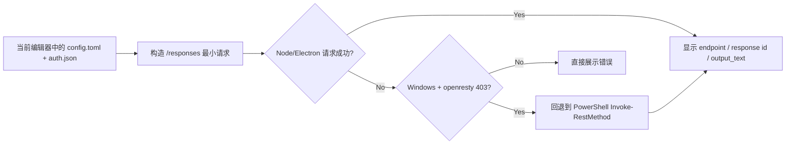

<div align="center">
  
  <h1>CC Provider Switch (Codex/Claude Code)</h1>
  <p><strong>一个面向 Codex / Claude Code 双工作流的 Electron 预设切换器（Windows / macOS）</strong></p>
  <p>把 <code>.codex/config.toml</code> / <code>auth.json</code> 以及 <code>~/.claude/settings.json</code> / <code>.claude.json patch</code> 的切换、编辑、保存、启用与额度查看，收束到一个更友好的桌面界面里。</p>

  <p>
    
    
    
    
  </p>

  <p>
    
  </p>

  <p><sub>README 展示图已脱敏，真实 provider key 仅保存在本地预设覆盖文件中。</sub></p>
</div>

## 更新日志

最新变更记录见 [CHANGELOG.md](./CHANGELOG.md)。

## 项目定位

这个项目解决的是一个很具体、但很烦的日常问题：

- 你可能会在多个 Codex relay / provider 与 Claude Code 后端之间频繁切换。
- 真正生效的配置文件分散在用户目录下的 `.codex` 和 `.claude` 中。
  Codex 示例：`%USERPROFILE%\.codex\config.toml`
  Claude 示例：`%USERPROFILE%\.claude\settings.json`
- Codex 和 Claude Code 的文件边界并不一样，一个是 `TOML + auth.json`，一个是 `settings.json + .claude.json patch`。
- 手动改文件容易漏改、改错，尤其是 `provider id`、`base_url`、模型名、补丁状态和密钥。
- 某些供应商“终端里能通，应用内测试却失败”，有些 Claude 场景又需要额外查看官方额度页面或平台控制台。

`Codex Provider Switch` 的目标不是替代 Codex 或 Claude Code，而是把这层“供应商配置管理”做成一个单独、清晰、可验证的工具。

## 核心能力

| 能力 | 说明 |
| --- | --- |
| 双产品切换 | 左上角可在 `Codex` 和 `Claude` 两套预设目录之间直接切换 |
| Codex 文件编辑 | 直接编辑 `config.toml` 与 `auth.json` |
| Claude Code 文件编辑 | 直接编辑 `~/.claude/settings.json`，并保存 `.claude.json patch` 的安全补丁 |
| 保存与启用分离 | `保存预设` 只保存到应用预设库，`启用` 才会写入当前产品真实生效文件 |
| 在线测试 | Codex 侧支持直接发起最小 `/responses` 请求；Claude 侧保留官方额度入口，不伪造 Codex 测试链路 |
| 自定义预设 | 支持新增自定义预设，名称和描述都可编辑 |
| 现有预设可编辑 | 包括内置预设，也支持修改名称、描述、配置内容和密钥后再保存 |
| 目标文件可追踪 | 清楚展示当前生效文件路径，方便你确认真正写到了哪里 |
| Claude 额度能力 | Claude 侧支持查看官方额度页面，GLM-5.1 卡片支持抓取 BigModel `每5小时使用额度` 与 `MCP 每月额度` |
| OpenRouter Claude 预设 | 内置 `qwen/qwen3.6-plus:free` 的 Claude/OpenRouter 预设，并在卡片中展示简化额度说明 |
| Windows 兼容回退 | 针对部分网关拦截 Node/Electron `fetch` 的场景，在线测试可在 Windows 下自动回退到 PowerShell 请求 |

## 当前工作流

1. 先在左上角选择当前要操作的产品：`Codex` 或 `Claude`。
2. 在左侧选择一个内置预设，或者点击 `+ 新增预设` 创建自定义预设。
3. 在右侧编辑当前产品对应的名称、说明和配置内容。
4. `保存预设` 只会写入应用自己的本地预设库，不会直接改系统真实文件。
5. 真正需要切换时，再点 `启用`，把当前编辑器内容写入 `.codex` 或 `.claude` 的真实文件。
6. Codex 侧可直接做在线测试；Claude 侧可直接查看额度页，或在 GLM-5.1 卡片里刷新 BigModel 额度。

## 内置预设

### Codex 预设

| 预设 | `model_provider` | 接口基址 | 备注 |
| --- | --- | --- | --- |
| `92scw` | `codex` | `http://92scw.cn/v1` | 走 `responses` |
| `GMN` | `codex` | `https://gmn.chuangzuoli.com` | 走 `responses` |
| `Gwen` | `gwen` | `https://ai.love-gwen.top/openai` | 走 `responses`，Windows 在线测试已兼容网关拦截回退 |
| `OpenAI Official` | `openai` | `https://api.openai.com/v1` | 官方直连 |
| `Quan2Go` | `quan2go` | `https://capi.quan2go.com/openai` | 激活码模式，支持日额度读取 |

### Claude Code 预设

| 预设 | 目标文件 | 接口基址 | 备注 |
| --- | --- | --- | --- |
| `GLM-5.1 (Claude Code)` | `~/.claude/settings.json` + `.claude.json patch` | `https://open.bigmodel.cn/api/anthropic` | BigModel Anthropic 兼容端点，内置官方额度抓取 |
| `OpenRouter Qwen3.6 Plus Free (Claude Code)` | `~/.claude/settings.json` + `.claude.json patch` | `https://openrouter.ai/api` | OpenRouter Anthropic 兼容端点，内置 `qwen/qwen3.6-plus:free` 与 80% auto compact |

Claude 产品页仍然支持保存其他自定义预设；当前 README 展示图里展示的 OpenRouter Claude 卡片现在也已经是仓库内置预设的一部分。

说明：

- 这些内置预设会保留在项目里，便于开箱即用。
- Claude 自定义预设和其密钥默认保存在应用本地预设覆盖文件中，不会写死进仓库。
- 仓库内默认 key 现在全部是脱敏示例值，不包含真实鉴权信息。
- 真正生效时，应用只会把你当前确认启用的内容写进用户目录下对应产品的真实文件。

## 产品文件边界

| 产品 | 实际生效目录 | 主配置文件 | 辅助文件 | 当前支持 |
| --- | --- | --- | --- | --- |
| `Codex` | `~/.codex/` | `config.toml` | `auth.json` | 预设切换、在线测试、provider 额度卡片 |
| `Claude Code` | `~/.claude/` | `settings.json` | `.claude.json patch` | 预设切换、BigModel 额度抓取、官方额度入口 |

## 在线测试链路（Codex）



这个回退逻辑是专门为 `Gwen` 这类“PowerShell 能用，但 Electron 默认 `fetch` 会被网关拦 403”的场景补上的。

Claude Code 产品页不复用这条 Codex `/responses` 测试链路，而是保持文件编辑、预设切换和额度查看三个边界分开。

## 项目结构

```text
src/
  main/
    bigmodel-auth-store.js  # BigModel 本地账号 / API Key 存储
    bigmodel-web-client.js  # BigModel 控制台登录与额度抓取
    claude-files.js         # 读取 / 写入用户目录下的 Claude 文件
    codex-files.js          # 读取 / 写入用户目录下的 .codex 文件
    gmn-account.js          # GMN 账号登录、session 刷新与 key 配额读取
    gwen-usage.js           # Gwen key 使用量读取
    main.js                 # Electron 主进程与 IPC 绑定
    newapi-token-usage.js   # 92scw token 用量读取
    openai-usage.js         # 官方 OpenAI ChatGPT 登录额度读取
    openrouter-usage.js     # OpenRouter Claude 预设的本地额度估算
    preset-overrides.js     # 内置预设覆盖与自定义预设持久化
    usage-stats-links.js    # 官方额度页面跳转
    provider-tester.js      # 在线测试与 Windows 回退逻辑
  preload/
    preload.js              # 暴露安全 IPC 接口
  renderer/
    gmn-display.js          # 各 provider 使用量卡片模型
    index.html              # 页面结构
    openai-auth.js          # 官方 OpenAI 编辑器态鉴权解析
    renderer.js             # 界面状态与交互
    styles.css              # 视觉样式
    usage-refresh-message.js
  shared/
    claude-config-service.js # Claude 预设识别、合并和摘要
    config-service.js       # 配置解析、脱敏和 provider 摘要
    product-catalog.js      # Codex / Claude 产品目录
    presets.js              # 内置预设定义
test/
  *.test.js                 # node:test 回归测试
```

## 本地运行

```bash
npm install
npm start
```

默认会打开 Electron 桌面应用，并读取：

- Windows：
  `Codex -> %USERPROFILE%\.codex\config.toml` / `%USERPROFILE%\.codex\auth.json`
  `Claude -> %USERPROFILE%\.claude\settings.json` / `%USERPROFILE%\.claude.json`
- macOS：
  `Codex -> ~/.codex/config.toml` / `~/.codex/auth.json`
  `Claude -> ~/.claude/settings.json` / `~/.claude.json`

## 测试

```bash
npm test
```

当前仓库包含的自动化测试主要覆盖：

- `.codex` 文件读写
- `.claude/settings.json` 与 `.claude.json patch` 合并 / 写入
- 预设识别与摘要生成
- Codex / Claude 产品目录隔离
- 内置预设与自定义预设保存
- 鉴权占位与 ChatGPT sign-in 兼容逻辑
- IPC 错误包装
- `/responses` 在线测试请求构造
- 92scw / GMN / Gwen / OpenAI 使用量读取
- BigModel 控制台额度抓取与 OpenRouter Claude 额度估算

## 构建

```bash
npm run build
npm run dist
```

按当前运行平台构建时：

- Windows 会输出 portable 包
- macOS 会输出 `dmg` 和 `zip`

如果你想显式指定平台，也可以使用：

```bash
npm run build:win
npm run build:mac
npm run dist:win
npm run dist:mac
```

## 敏感信息与提交策略

- 仓库不应提交真实 `auth.json`、`.codex/` 目录、副本 session 文件或真实 provider key。
- 仓库同样不应提交真实 `~/.claude/settings.json`、`.claude.json`、BigModel 本地凭据文件或 OpenRouter / Claude 实际 key。
- 当前 `.gitignore` 已排除 `auth.json`、`.codex/`、`gmn-session.json`、`.env*` 和常见证书文件。
- 如果你在本地把某个 key 改成自己的正式密钥，请只让它留在用户目录或本地应用预设存储里，不要把真实运行时鉴权提交出去。

## 后续可继续扩展的方向

- 预设导入 / 导出
- 预设删除与排序
- 多环境配置分组
- 更完整的测试诊断日志
- 发布可下载的便携版发行页
